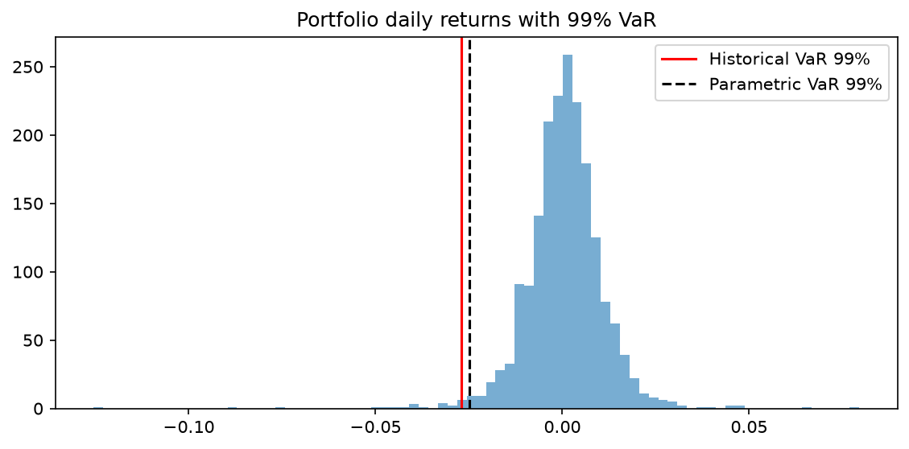
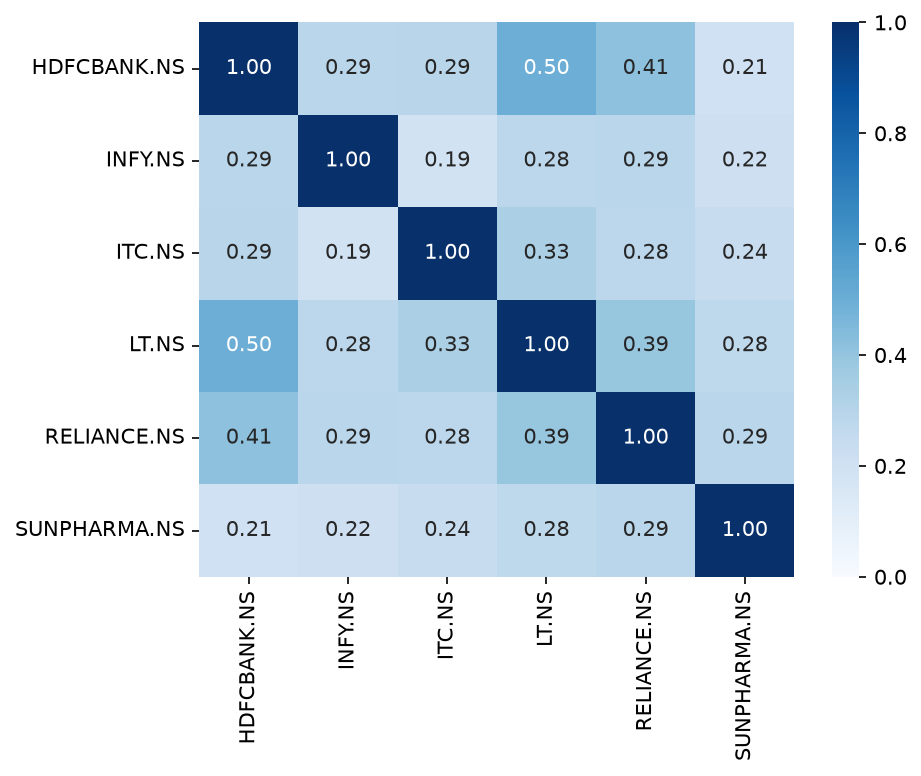
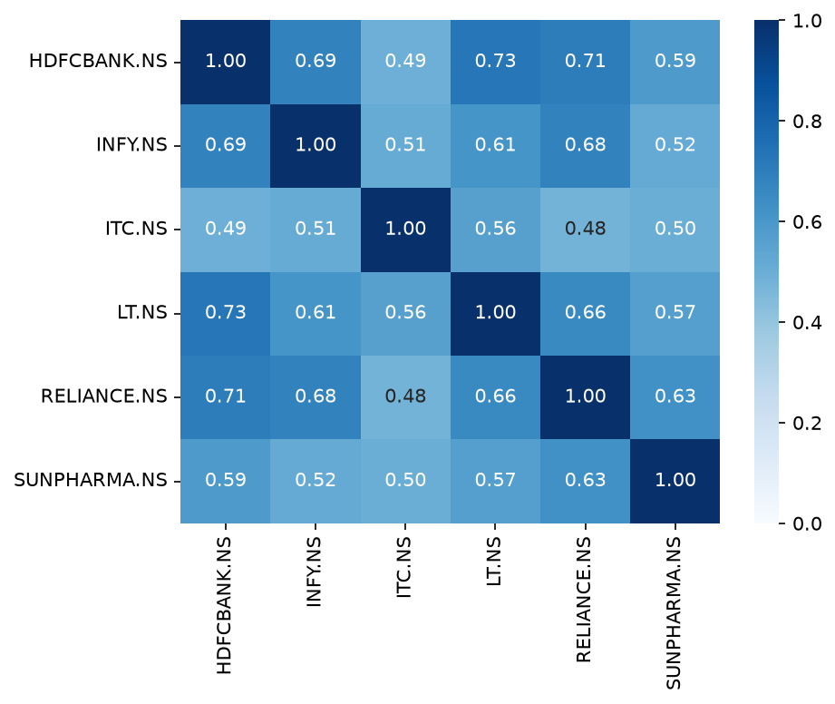

# Equity Market Risk Engine: Value at Risk on an Indian Stock Portfolio

A hands-on market risk project that builds 1-day Value at Risk (VaR) for a six-stock Indian equity portfolio, compares parametric and historical methods, and investigates why they disagree: fat tails, volatility clustering, diversification and crisis-time correlations.

**Status:** Phase 1 (equities, in-sample analysis) is complete. Out-of-sample backtesting, Monte Carlo VaR and Expected Shortfall are next (see [Roadmap](#roadmap)).

## Objective

Build a small but realistic market risk pipeline from raw prices to risk numbers, and document what the data shows about the assumptions behind each VaR method. The aim is to understand when the models work, when they fail, and why.

## Portfolio and data

| Ticker | Sector |
|---|---|
| HDFCBANK.NS | Banking |
| RELIANCE.NS | Energy / conglomerate |
| INFY.NS | IT services |
| ITC.NS | FMCG |
| SUNPHARMA.NS | Pharma |
| LT.NS | Infrastructure / engineering |

- **Source:** Yahoo Finance via `yfinance` (daily adjusted close), pulled in September 2026.
- **Period:** January 2019 to date, about 1,900 trading days, including the March 2020 COVID crash.
- **Portfolio:** equal weights, notional ₹10 crore (₹100,000,000). Single-stock analysis uses a ₹10 lakh (₹1,000,000) position.

## Methodology

- **Returns:** simple daily returns, `r_t = P_t / P_{t-1} - 1`. Portfolio return is the weighted sum of stock returns with constant weights.
- **Historical VaR (99%):** the empirical 1st percentile of daily returns, multiplied by the position value.
- **Parametric VaR (99%):** `z(0.99) x sqrt(w' Σ w) x V`, using the sample covariance matrix and a zero mean for the portfolio. The single-stock version uses the threshold `mean + z(0.01) x std`.
- **Breach:** a day on which the return is worse than -VaR.
- **Sign convention:** VaR is reported as a positive loss.

## Key findings

### 1. Returns are not normal

Every stock shows heavy tails. A move beyond 4 standard deviations should occur about 0.1 times in ~1,900 days if returns were normal. The data shows 11 to 16 such days per stock, roughly 100 times more often.

| Stock | Worst day | Date | Days beyond 4σ |
|---|---|---|---|
| HDFCBANK.NS | -12.61% | 2020-03-23 | 11 |
| RELIANCE.NS | -13.15% | 2020-03-23 | 16 |
| INFY.NS | -16.19% | 2019-10-22 | 15 |
| ITC.NS | -12.08% | 2020-03-23 | 16 |
| SUNPHARMA.NS | -11.16% | 2020-03-23 | 11 |
| LT.NS | -16.27% | 2020-03-23 | 12 |

Five of the six stocks had their worst day on the same date (23 March 2020, a systemic shock), while INFY's worst day came from company-specific news. Diversification protects against the second kind of event far better than the first.

### 2. Single-stock VaR (HDFCBANK.NS, ₹10 lakh position, 99%, 1-day)

| Method | VaR | Threshold | Breaches (~1,900 days) |
|---|---|---|---|
| Historical | ₹38,634 | -3.86% | 20 |
| Parametric | ₹36,098 | -3.61% | 27 |

- A 99% VaR promises about 19 breaches. Parametric produced 27 (1.4% of days), consistent with the fat-tail effect.
- The 27 breaches fell in only 17 different months. Nine of them came in March to May 2020, with smaller clusters in early 2021 and early 2022. **Breaches arrive in bunches, not evenly.**
- The average return on breach days was -5.6% (about ₹56,000 on ₹10 lakh), roughly 55% worse than the VaR threshold. VaR says nothing about how bad the bad days are, which is the motivation for Expected Shortfall.

### 3. Portfolio VaR (equal weights, ₹10 crore, 99%, 1-day)

| Method | VaR (% of portfolio) | Breaches |
|---|---|---|
| Historical | 2.70% | 20 |
| Parametric | 2.48% (₹24.8 lakh) | 25 |

Portfolio VaR is well below the single-stock figure of about 3.6%, which is diversification at work. Parametric is again lower than historical.

### 4. Diversification benefit

| | Sum of standalone VaRs | Portfolio VaR | Benefit |
|---|---|---|---|
| Full period | ₹38.4 lakh | ₹24.8 lakh | **35.3%** |
| Crisis (15 Feb to 30 Apr 2020) | | | **18.3%** |

Average pairwise correlation is about 0.30 over the full period (range 0.19 to 0.50) but about 0.60 in the crisis window (range 0.48 to 0.73). Diversification roughly halves exactly when it is needed most, and stock volatilities rise at the same time. The crisis window is only about 55 trading days, so treat its exact figures as noisy.

### 5. Window length is a model risk

The same portfolio gives very different VaR depending on the lookback window.

| Window | Historical | Parametric | Avg stock vol | Avg correlation |
|---|---|---|---|---|
| Last 250 days | 2.15% | 2.00% | 1.43% | 0.23 |
| Last 1000 days | 1.99% | 1.89% | 1.34% | 0.24 |
| Full history | 2.70% | 2.48% | 1.65% | 0.30 |

- The full-history window is about 31% higher (parametric) than the 1000-day window with no change in the portfolio, mainly because it contains March 2020.
- The gap between parametric and historical VaR is widest when a crisis is in the sample (0.22 points) and narrowest in the calm 1000-day window (0.10 points).

### 6. Two levers drive portfolio risk

For an equal-weighted portfolio of `n` stocks with similar volatilities:

```
portfolio vol ≈ average stock vol x sqrt(1/n + (1 - 1/n) x average correlation)
```

This approximation reproduces the parametric VaR in the table above to within 0.01 percentage points in every window. Going from the 1000-day window to the full history, roughly three-quarters of the VaR increase comes from higher volatility and roughly one-quarter from higher correlation.

## Charts







## Limitations

- **In-sample only.** Both methods were estimated on the same data they were tested on. Historical VaR breaches near 1% are guaranteed by construction, and the parametric parameters also use the full sample. No conclusion about model quality can be drawn until the rolling out-of-sample backtest is built.
- Constant equal weights, no rebalancing, equities only, 1-day horizon only.
- Static covariance estimate (no EWMA or GARCH), so volatility clustering is not modelled.
- VaR ignores the size of losses beyond the threshold.
- Free Yahoo Finance data is convenient but not an audited source.

## Roadmap

- [ ] Move core functions into `src/var_lib.py` with unit tests
- [ ] Rolling out-of-sample backtest for historical and parametric VaR
- [ ] Kupiec and Christoffersen tests, Basel traffic-light zones
- [ ] Monte Carlo VaR (Cholesky, then t-copula)
- [ ] EWMA volatility and filtered historical simulation
- [ ] Expected Shortfall and stressed VaR
- [ ] Marginal, component and incremental VaR
- [ ] Historical stress scenarios
- [ ] Model methodology and validation report

## Repository structure

```
var-project/
├── data/            # downloaded prices (git-ignored, recreated by notebook 01)
├── images/          # charts used in this README
├── notebooks/
│   ├── 01_data.ipynb
│   ├── 02_single_stock_var.ipynb
│   └── 03_portfolio_var.ipynb
├── src/             # reusable functions
├── tests/
├── requirements.txt
└── README.md
```

## How to run

```bash
git clone <this-repo-url>
cd var-project
python -m venv .venv
source .venv/bin/activate        # Windows: .venv\Scripts\activate
pip install -r requirements.txt
```

Open the notebooks in order (01, 02, 03). Notebook 01 downloads the price data into `data/`.

## Disclaimer

This is an educational project. It is not investment advice and is not a production risk system.